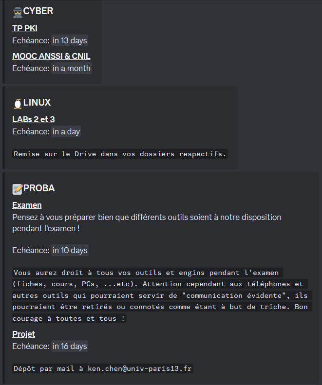
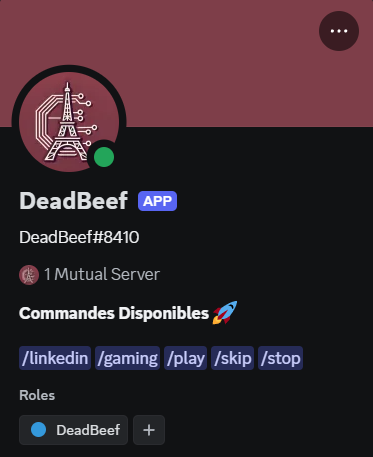
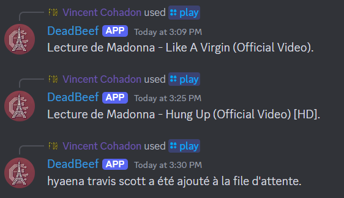

# DeadBeef

## Installation

```sh
# Clone repository
git clone https://github.com/0xf1d0/deadbeef

cd deadbeef
# Consider using a virtual environment
python3 -m venv .venv
source .venv/bin/activate

# Install dependencies
pip install -r requirements.txt

# Execute program
./start.sh
```

## Features

### Calendar System



### Multiple capabilities



### Music System using yt-dlp



And more ...